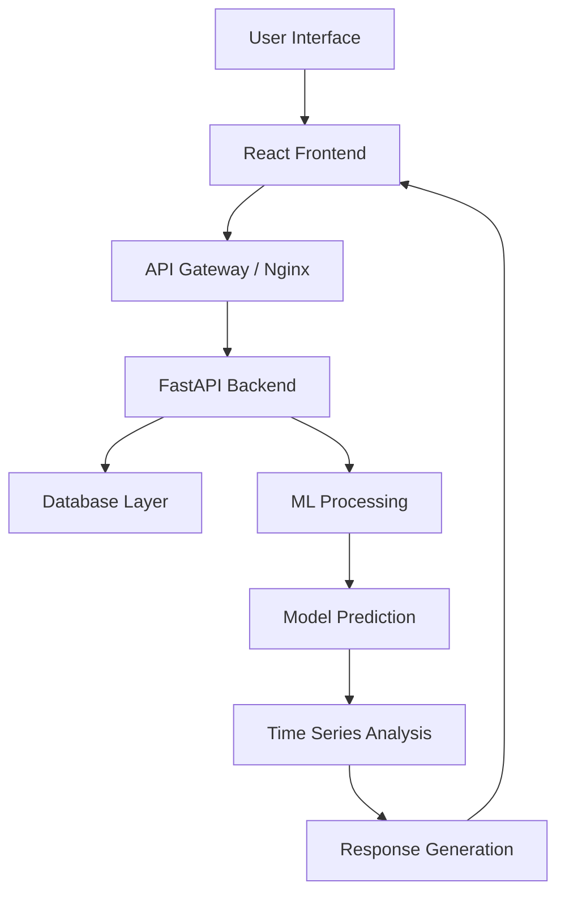
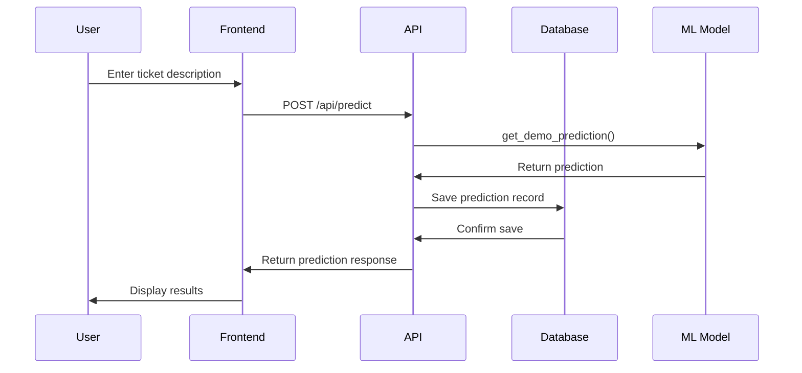
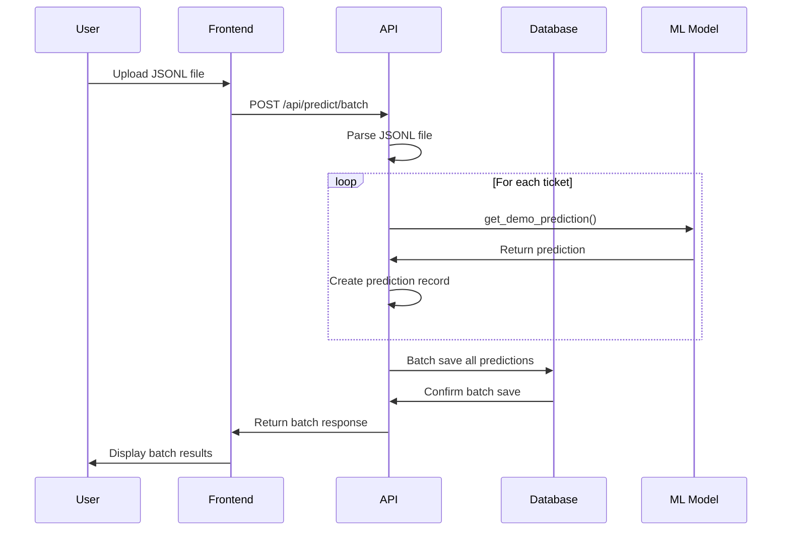
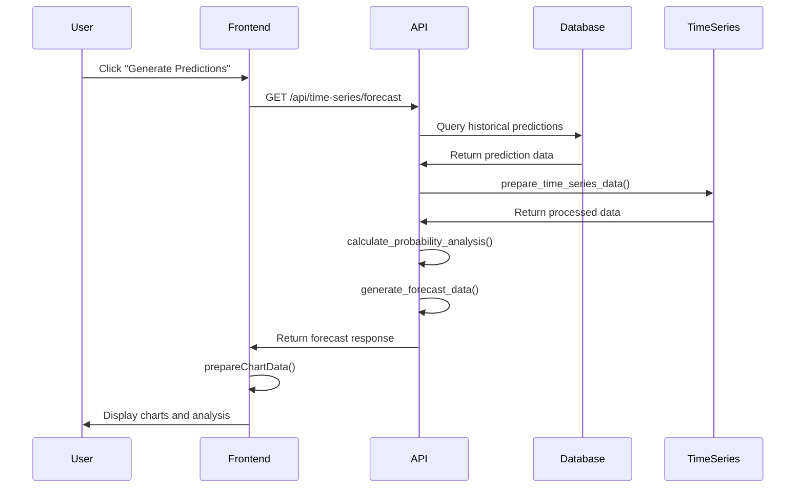

# System Flow Documentation

## 🔄 Complete Application Flow

This document outlines the complete data flow and function call sequences in the CERT-EU Ticket Classification System.

## 📊 High-Level System Flow



## 🎯 Core Function Flows

### 1. Single Ticket Classification Flow

```
User Input → Frontend → API → ML Model → Database → Response

Detailed Flow:
1. User enters ticket in TicketAnalyzer.js
2. handleSubmit() → analyzeTicket()
3. POST /api/predict → predict_single_demo()
4. predict_single_demo() → load_demo_model()
5. load_demo_model() → get_demo_prediction()
6. get_demo_prediction() → create_prediction_record()
7. create_prediction_record() → db.add() → db.commit()
8. Response → Frontend → Display Results
```

### 2. Batch Processing Flow

```
File Upload → Validation → Processing → Database → Dashboard Update

Detailed Flow:
1. User uploads JSONL file in TicketAnalyzer.js
2. handleFileUpload() → validateFile()
3. analyzeBatch() → POST /api/predict/batch
4. predict_batch_demo() → process_batch_tickets()
5. For each ticket: get_demo_prediction() → create_prediction_record()
6. Batch commit to database
7. Response → Frontend → Update Dashboard Stats
```

### 3. Time Series Forecasting Flow

```
Historical Data → Analysis → Forecasting → Probability Analysis → Charts

Detailed Flow:
1. User clicks "Generate Predictions" in TimeSeriesForecast.js
2. makePredictions() → GET /api/time-series/forecast
3. get_forecast() → get_queue_distribution()
4. get_queue_distribution() → db.query(Prediction.predicted_queue)
5. calculate_probability_analysis() → generate_forecast_data()
6. Response → Frontend → prepareChartData() → Render Charts
```

## 🔧 Detailed Function Call Sequences

### Frontend Component Flow

#### TicketAnalyzer.js
```javascript
// Single Ticket Flow (from TicketAnalyzer.js)
const analyzeTicket = async () => {
  if (!ticketData.title || !ticketData.content) {
    toast.error('Please fill in title and content');
    return;
  }
  setLoading(true);
  try {
    const response = await axios.post('/api/predict', ticketData);
    setPrediction(response.data);
    toast.success('Ticket analyzed successfully');
  } catch (error) {
    console.error('Error analyzing ticket:', error);
    toast.error('Failed to analyze ticket');
  } finally {
    setLoading(false);
  }
};

// Batch Processing Flow (from TicketAnalyzer.js)
const handleFileUpload = (e) => {
  const uploadedFile = e.target.files[0];
  const fileName = uploadedFile.name.toLowerCase();
  const isValidFile = uploadedFile.type === 'application/json' || 
                     uploadedFile.type === 'text/plain' ||
                     fileName.endsWith('.json') || 
                     fileName.endsWith('.jsonl');
  
  if (uploadedFile && isValidFile) {
    setFile(uploadedFile);
    toast.success('File uploaded successfully');
  } else {
    toast.error('Please upload a JSON or JSONL file');
  }
};

const analyzeBatch = async () => {
  if (!file) {
    toast.error('Please select a file');
    return;
  }
  setLoading(true);
  try {
    const formData = new FormData();
    formData.append('file', file);
    
    const response = await axios.post('/api/predict/batch', formData, {
      headers: { 'Content-Type': 'multipart/form-data' }
    });
    
    const message = response.data.message || `Successfully processed ${response.data.results?.length || 0} tickets`;
    toast.success(`Batch analysis completed: ${message}`);
    setPrediction(null);
  } catch (error) {
    console.error('Error analyzing batch:', error);
    const errorMessage = error.response?.data?.detail || error.message || 'Failed to analyze batch';
    toast.error(`Batch analysis failed: ${errorMessage}`);
  } finally {
    setLoading(false);
  }
};
```

#### TimeSeriesForecast.js
```javascript
// Data Loading Flow (from TimeSeriesForecast.js)
useEffect(() => {
  fetchData();
}, [dateRange]);

const fetchData = async () => {
  try {
    const [trendsResponse, historicalResponse] = await Promise.all([
      axios.get('/api/time-series/trends'),
      axios.get(`/api/time-series/historical?days=${dateRange}`)
    ]);
    
    setHistoricalData(trendsResponse.data.trends || trendsResponse.data);
    setModelStatus({ models_loaded: true });
  } catch (error) {
    console.error('Error fetching data:', error);
  }
};

// Prediction Generation Flow (from TimeSeriesForecast.js)
const makePredictions = async () => {
  try {
    setLoading(true);
    const response = await axios.get(`/api/time-series/forecast?days=${daysAhead}`);
    setPredictions(response.data);
    console.log('🔮 Forecasts structure:', response.data.forecasts);
  } catch (error) {
    console.error('Error generating predictions:', error);
  } finally {
    setLoading(false);
  }
};
```

### Backend API Flow

#### main.py - Core API Functions

```python
# Single Prediction Flow (from main.py)
@app.post("/api/predict", response_model=PredictionResponse)
async def predict_single_demo(ticket: TicketRequest, db: Session = Depends(get_db)):
    try:
        # Generate demo prediction
        prediction_data = get_demo_prediction(ticket.content)
        
        # Create prediction record
        prediction_record = Prediction(
            id=str(uuid.uuid4()),
            ticket_id=ticket.ticket_id,
            predicted_queue=prediction_data['queue'],
            confidence_score=prediction_data['confidence'],
            all_probabilities=prediction_data['all_probabilities'],
            prediction_timestamp=datetime.now(),
            processing_time_ms=prediction_data.get('processing_time_ms', 0),
            routing_decision=prediction_data['routing_decision']
        )
        
        db.add(prediction_record)
        db.commit()
        
        return PredictionResponse(
            id=prediction_record.id,
            predicted_queue=prediction_record.predicted_queue,
            confidence_score=float(prediction_record.confidence_score),
            all_probabilities=prediction_record.all_probabilities,
            processing_time_ms=prediction_record.processing_time_ms,
            routing_decision=prediction_record.routing_decision
        )
    except Exception as e:
        db.rollback()
        raise HTTPException(status_code=500, detail=f"Prediction failed: {str(e)}")

# Batch Processing Flow (from main.py)
@app.post("/api/predict/batch")
async def predict_batch_demo(file: UploadFile, db: Session = Depends(get_db)):
    try:
        content = await file.read()
        if len(content) > 50 * 1024 * 1024:  # 50MB limit
            raise HTTPException(status_code=413, detail="File too large. Maximum size is 50MB.")
        
        lines = content.decode('utf-8').strip().split('\n')
        results = []
        processed_count = 0
        
        for line in lines:
            if not line.strip():
                continue
                
            try:
                ticket_data = json.loads(line)
                
                # Generate mock prediction based on keywords
                text = f"{ticket_data.get('title', '')} {ticket_data.get('content', '')}".lower()
                
                # Simple keyword-based classification
                queue_keywords = {
                    "CTI": ["threat", "intelligence", "ioc", "malware", "apt", "campaign", "actor"],
                    "DFIR::incidents": ["incident", "breach", "compromise", "attack", "intrusion"],
                    "DFIR::phishing": ["phishing", "email", "spam", "suspicious", "fake", "scam"],
                    "OFFSEC::CVD": ["vulnerability", "cve", "patch", "disclosure", "security"],
                    "OFFSEC::Pentesting": ["pentest", "penetration", "assessment", "test", "audit"],
                    "SMS": ["policy", "compliance", "training", "awareness", "administrative"],
                    "Trash": ["garden", "hose", "offer", "sale", "promotion", "unsubscribe"]
                }
                
                # Calculate scores based on keyword matches
                scores = {}
                for queue, keywords in queue_keywords.items():
                    score = sum(1 for keyword in keywords if keyword in text)
                    scores[queue] = score
                
                # If no keywords match, assign randomly
                if max(scores.values()) == 0:
                    predicted_queue = random.choice(list(queue_keywords.keys()))
                    confidence = random.uniform(0.6, 0.8)
                else:
                    predicted_queue = max(scores, key=scores.get)
                    confidence = min(0.9, 0.6 + (scores[predicted_queue] * 0.1))
                
                # Create prediction record
                prediction_record = Prediction(
                    id=str(uuid.uuid4()),
                    ticket_id=ticket_data.get('ticket_id', f'TKT-BATCH-{processed_count}'),
                    predicted_queue=predicted_queue,
                    confidence_score=confidence,
                    prediction_timestamp=datetime.now(),
                    routing_decision="auto_route" if confidence >= 0.85 else "human_verify"
                )
                
                db.add(prediction_record)
                results.append({
                    "ticket_id": ticket_data.get('ticket_id', f'TKT-BATCH-{processed_count}'),
                    "predicted_queue": predicted_queue,
                    "confidence_score": confidence,
                    "routing_decision": prediction_record.routing_decision
                })
                processed_count += 1
                
            except json.JSONDecodeError as e:
                print(f"Error parsing line {processed_count}: {e}")
                continue
        
        db.commit()
        return {"message": f"Successfully processed {processed_count} tickets", "results": results}
        
    except Exception as e:
        db.rollback()
        raise HTTPException(status_code=500, detail=f"Batch processing failed: {str(e)}")

# Time Series Forecast Flow
@app.get("/api/time-series/forecast")
async def get_forecast(days: int, db: Session):
    ↓
    queue_counts = db.query(Prediction.predicted_queue).group_by(...)
    ↓
    forecasts = {}
    for queue, count in queue_counts:
        ↓
        avg_daily = count / 30
        ↓
        forecast_dates = generate_dates(days)
        ↓
        forecast_values = generate_values(avg_daily, days)
        ↓
        forecasts[queue] = {dates, values, trend}
    ↓
    probability_analysis = calculate_probability_analysis(queue_counts)
    ↓
    return ForecastResponse(forecasts, probability_analysis, ...)
```

#### database.py - Data Layer Flow

```python
# Database Connection Flow (from database.py)
def get_db():
    db = SessionLocal()
    try:
        yield db
    finally:
        db.close()

# Prediction Creation Flow (from main.py)
def create_prediction_record(ticket_data, prediction_data, db):
    return Prediction(
        id=str(uuid.uuid4()),
        ticket_id=ticket_data.get('ticket_id', f'TKT-{uuid.uuid4()}'),
        predicted_queue=prediction_data['queue'],
        confidence_score=prediction_data['confidence'],
        prediction_timestamp=datetime.now(),
        routing_decision=prediction_data['routing_decision'],
        all_probabilities=prediction_data.get('all_probabilities', {}),
        processing_time_ms=prediction_data.get('processing_time_ms', 0)
    )
```

#### time_series_predictor.py - ML Processing Flow

```python
# Time Series Data Preparation Flow (from time_series_predictor.py)
def prepare_time_series_data(self, db):
    query = db.query(Prediction).filter(
        Prediction.prediction_timestamp >= datetime.now() - timedelta(days=30)
    )
    predictions = query.all()
    
    data = []
    for pred in predictions:
        data.append({
            'date': pred.prediction_timestamp.date(),
            'queue': pred.predicted_queue,
            'ticket_count': 1
        })
    
    df = pd.DataFrame(data)
    if not df.empty:
        df['date'] = pd.to_datetime(df['date'])
        df = df.groupby(['date', 'queue']).size().reset_index(name='ticket_count')
    
    return df

# Forecast Generation Flow (from main.py)
@app.get("/api/time-series/forecast")
async def get_forecast(days: int = 7, db: Session = Depends(get_db)):
    queue_counts = db.query(
        Prediction.predicted_queue,
        func.count(Prediction.id).label('count')
    ).group_by(Prediction.predicted_queue).all()
    
    forecasts = {}
    for row in queue_counts:
        queue = row.predicted_queue
        count = row.count
        avg_daily = count / 30  # Assume data spans ~30 days
        
        forecast_dates = []
        forecast_values = []
        base_date = datetime.now()
        
        for i in range(1, days + 1):
            forecast_date = base_date + timedelta(days=i)
            forecast_value = max(0, int(avg_daily * (1 + 0.1 * (i % 3 - 1))))
            forecast_dates.append(forecast_date.strftime('%Y-%m-%d'))
            forecast_values.append(forecast_value)
        
        forecasts[queue] = {
            "dates": forecast_dates,
            "values": forecast_values,
            "avg_daily": round(avg_daily, 2),
            "trend": "stable" if avg_daily > 0 else "declining"
        }
    
    return {"forecasts": forecasts, "forecast_days": days}
```

## 🔄 Data Flow Diagrams

### 1. User Journey Flow



### 2. Batch Processing Flow



### 3. Time Series Forecasting Flow



## 🏗️ Component Interaction Flow

### Frontend Component Hierarchy

```
App.js
├── Layout.js
│   ├── Navigation
│   └── Main Content
│       ├── Dashboard.js
│       │   ├── StatsCards
│       │   ├── QueuePerformance
│       │   └── RecentTickets
│       ├── TicketAnalyzer.js
│       │   ├── SingleTicketForm
│       │   ├── BatchUpload
│       │   └── ResultsDisplay
│       ├── TimeSeriesForecast.js
│       │   ├── DateRangeSelector
│       │   ├── ForecastCharts
│       │   ├── ProbabilityAnalysis
│       │   └── ExportControls
│       ├── HumanReview.js
│       │   ├── TicketList
│       │   ├── FilterControls
│       │   └── FeedbackForm
│       └── Reports.js
│           ├── ReportGenerator
│           ├── EmailSettings
│           └── ExportOptions
```

### Backend Module Structure

```
main.py (FastAPI App)
├── Database Models
│   ├── Ticket
│   ├── Prediction
│   ├── Feedback
│   └── User
├── API Endpoints
│   ├── /api/predict (Single)
│   ├── /api/predict/batch (Batch)
│   ├── /api/dashboard/* (Stats)
│   ├── /api/time-series/* (Forecasting)
│   ├── /api/tickets/* (Review)
│   └── /api/reports/* (Reports)
├── ML Processing
│   ├── load_demo_model()
│   ├── get_demo_prediction()
│   └── create_prediction_record()
└── Utility Functions
    ├── validate_ticket()
    ├── parse_jsonl_file()
    └── send_email_report()

time_series_predictor.py
├── TimeSeriesPredictor Class
│   ├── prepare_time_series_data()
│   ├── fit_arima_model()
│   ├── predict_future()
│   └── analyze_trends()
└── Helper Functions
    ├── calculate_moving_average()
    ├── detect_seasonality()
    └── generate_forecast_dates()

database.py
├── Database Configuration
│   ├── create_engine()
│   ├── sessionmaker()
│   └── get_db()
├── Model Definitions
│   ├── Base Class
│   └── Table Definitions
└── Connection Management
    ├── connect()
    ├── disconnect()
    └── health_check()
```

## 🔄 State Management Flow

### Frontend State Flow

```javascript
// Global State Management
const [tickets, setTickets] = useState([])
const [predictions, setPredictions] = useState({})
const [loading, setLoading] = useState(false)
const [error, setError] = useState(null)

// State Update Flow
User Action → API Call → Loading State → Success/Error → Update State → Re-render

// Example: Ticket Analysis
1. User submits ticket
2. setLoading(true)
3. API call to /api/predict
4. setPredictions(response.data)
5. setLoading(false)
6. Component re-renders with new data
```

### Backend State Flow

```python
# Database State Management
Session → Transaction → Commit/Rollback → State Update

# Example: Prediction Creation
1. db = get_db()
2. prediction = create_prediction_record(...)
3. db.add(prediction)
4. db.commit()  # State persisted
5. db.close()
```

## 🚀 Performance Optimization Flow

### Caching Strategy

```
Request → Check Cache → Cache Hit? → Return Cached Data
                ↓
            Cache Miss
                ↓
        Process Request → Store in Cache → Return Data
```

### Database Optimization

```
Query → Index Lookup → Result Set → Pagination → Response
  ↓
Query Optimization
  ↓
Connection Pooling
  ↓
Transaction Management
```

## 🔒 Security Flow

### Authentication Flow

```
Request → Validate Token → Check Permissions → Process Request → Response
  ↓
Token Validation
  ↓
Role-based Access
  ↓
Rate Limiting
```

### Data Validation Flow

```
Input → Pydantic Validation → Sanitization → Processing → Output
  ↓
Type Checking
  ↓
Format Validation
  ↓
Security Checks
```

## 📊 Monitoring Flow

### Logging Flow

```
Event → Logger → Log Level Check → Format Message → Write to Log
  ↓
Structured Logging
  ↓
Error Tracking
  ↓
Performance Metrics
```

### Health Check Flow

```
Health Check Request → Service Status → Database Check → ML Model Check → Response
  ↓
Service Availability
  ↓
Resource Usage
  ↓
Error Rate Monitoring
```

---

This flow documentation demonstrates the complete system architecture and can be used to explain the technical implementation during interviews. Each flow shows the progression from user interaction to data processing and response generation.
